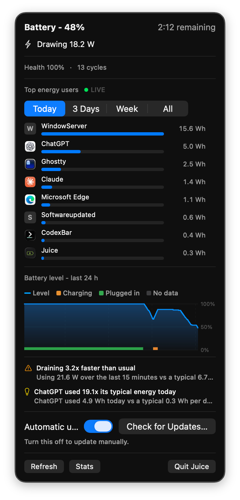
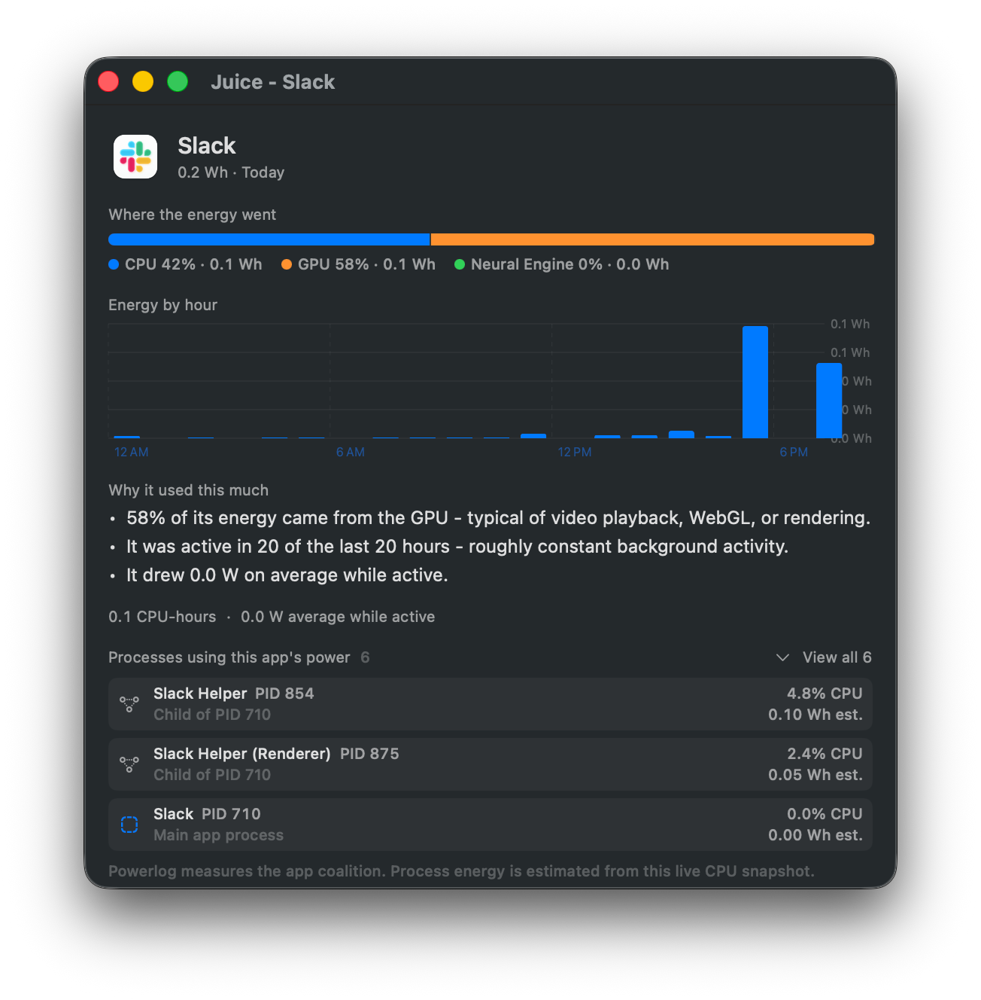
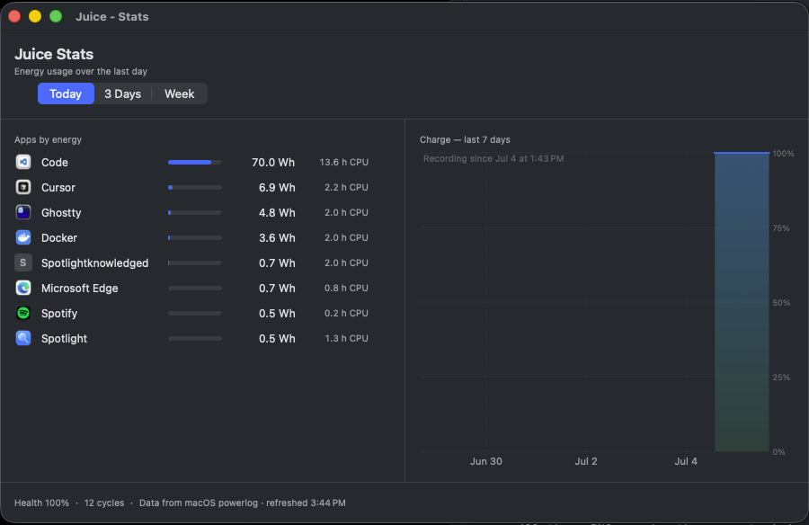
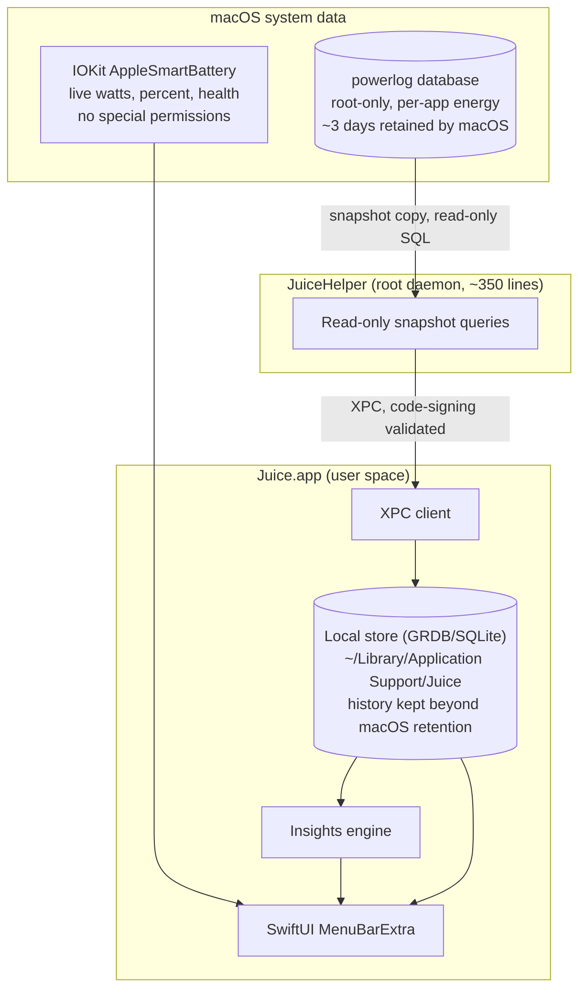

# Juice

A macOS menu bar app that shows what is eating your battery.


<p align="center">
  
</p>

<p align="center"><em>Live battery status, per-app energy rankings, charge history, and plain-English insights - one click away in the menu bar.</em></p>

## Why Juice

macOS records detailed per-app energy accounting around the clock, but it never shows you the history.
Activity Monitor displays a rolling 12-hour number, and the battery menu lists at most a few "apps using significant energy" right now.
The real data lives in a hidden root-only database (`/var/db/powerlog`), where the OS meters every app's CPU, GPU, and Neural Engine energy in nanojoules.

Juice surfaces that data: which apps used how many watt-hours today, over the last 3 days, or the last week, how fast your battery is draining right now, and why a given app used as much energy as it did.

## Features

- **Menu bar live readout**: battery percent and live watts drawn (or charging wattage), updated continuously.
- **Top energy users**: per-app watt-hours for Today, 3 Days, or Week, with real app icons.
- **Per-app detail**: click any app to see where its energy went (CPU vs GPU vs Neural Engine), an hour-by-hour usage chart, and a plain-English explanation of the usage pattern.
- **Charge timeline**: battery level over the last 24 hours, sampled locally every minute, with on-AC periods highlighted.
- **Insights**: drain-rate anomalies measured against your own 7-day baseline, apps using far more than their typical energy, the energy hog of the week, and charging-habit observations.
- **Stats window**: the full app table (not just the top 8) plus a 7-day charge chart and battery health.
- **In-app updates**: choose automatic download-and-install updates, or keep updates manual and use “Check for Updates…” whenever you want. Homebrew installs update directly from Juice's signed release feed.
- **Honest charts**: axes are pinned to the real time window, recording gaps show as gaps, and partial data is labeled as such - the charts never stretch or interpolate data to look fuller than it is.
- **Private by default**: no telemetry, system profile, or accounts. Juice only contacts its release feed when you ask it to check for updates or enable automatic updates.

<p align="center">
  
</p>

<p align="center">
  
</p>

## Architecture

The interesting problem: the energy data sits in a root-only SQLite database, but a menu bar app should not run as root.
Juice splits in two.



Security model for the privileged helper:

- The helper is about 350 lines, exposes exactly two XPC methods (a version handshake and a time-bounded energy query), and is easy to audit.
- It validates the connecting client's code signature on every message and rejects root clients.
- It never opens the live system database in place; it snapshot-copies the database and reads the copy read-only, so it cannot contend with or corrupt the system's writer.
- If you decline to install it, the app still works with live battery data; only per-app history is unavailable.

## Requirements

- macOS 14 (Sonoma) or later, Apple Silicon or Intel.
- A Swift 6 toolchain (Xcode 16 or later) to build from source.

## Install (from source)

Juice can be packaged as a normal macOS application bundle for local use. A
Developer ID certificate is required to distribute a notarized release to other
people.

```bash
git clone https://github.com/EClinick/juice.git
cd juice
swift build

# Install the privileged helper (asks for sudo, see below for what it does)
make dev-helper-install

# Sign the app binary so the helper accepts its XPC connections
make dev-app-sign

# Run
./.build/debug/Juice
```

## Build a macOS app bundle

Create a launchable menu-bar app at `dist/Juice.app`:

```bash
make app
open dist/Juice.app
```

The local build uses an ad-hoc signature and works with the existing
development helper. To prepare a Developer ID release, install your
certificates in Keychain Access and provide the application certificate name:

```bash
SIGNING_IDENTITY="Developer ID Application: Your Name (TEAMID)" \
SPARKLE_PUBLIC_ED_KEY="your Sparkle EdDSA public key" \
VERSION=1.0.0 make dmg
```

This creates `dist/Juice.dmg`, with Juice.app and an Applications shortcut.
Before sharing it, notarize the disk image and staple Apple's ticket. Generate
an EdDSA key pair once with Sparkle's `generate_keys`, keep the private key
outside the repository, and sign every release in `appcast.xml` with
`generate_appcast`:

```bash
make appcast \
  APPCAST_DOWNLOAD_URL_PREFIX="https://github.com/EClinick/juice/releases/download/v1.0.0/"
```

Upload both the DMG and the resulting `dist/appcast.xml` to the versioned
GitHub release so Sparkle can safely update installed copies. The
privileged helper remains a separate admin-approved install until it is moved
to an `SMAppService` launch-daemon package.

`make dev-helper-install` builds the helper, copies it to `/Library/PrivilegedHelperTools/com.eclinick.juice.helper`, installs a launchd daemon plist at `/Library/LaunchDaemons/com.eclinick.juice.helper.plist`, and bootstraps it.
The daemon starts on demand when the app connects and is idle otherwise.
Remove everything cleanly with `make dev-helper-uninstall`.

Note that the development install uses an ad-hoc signature with an identifier-only client check, which is fine for a machine you control but is not the production trust model.
Signed releases will use `SMAppService` with a Team ID pinned requirement and a one-click approval in System Settings.

## How the numbers work

- Energy figures come from macOS's own per-coalition accounting in the powerlog database: CPU, GPU, and Neural Engine energy in nanojoules, converted to watt-hours (`Wh = nJ / 3.6e12`).
- A "coalition" is an app plus all its helper processes, which is why the numbers map to apps the way you would expect.
- macOS retains only about 3 days of this data; Juice's local store accumulates daily rollups (kept for a year) and battery samples (kept for 90 days), so your history grows beyond what the OS keeps.
- Rollup rebuilds only replace days the source data fully covers, so macOS purging its own retention window can never erase Juice's stored history.
- The displayed values have been audited against the raw database with independent SQL: stored per-app watt-hours matched the source to floating-point precision.

## Development

```bash
swift build

# Tests (uses the full Xcode toolchain rather than Command Line Tools)
make test

# End-to-end XPC test against the installed helper
make dev-probe

# Per-app breakdown end-to-end (exactly what the detail window computes)
./.build/debug/JuiceXPCProbe --app com.microsoft.VSCode
```

Layout: `Sources/Juice` is the menu bar app, `Sources/JuiceHelper` is the root daemon, `Sources/JuiceXPCShared` is the XPC protocol, and `Sources/JuiceCore` holds the pure logic (store, rollups, insights, breakdowns) that the test suite covers.

## Privacy

Everything stays on your Mac.
Juice reads the system's power accounting and battery state, stores derived data in `~/Library/Application Support/Juice`, and sends nothing anywhere.

## Roadmap

- Developer ID signed and notarized releases (DMG and Homebrew cask).
- `SMAppService` helper installation with one-click approval in System Settings, replacing the sudo Makefile flow.
- Backfilling older history from the powerlog archive files macOS keeps on disk.

## Status

Early development.
The powerlog schema is undocumented Apple internals and can change in any macOS release; Juice probes the schema first and degrades gracefully (live battery data keeps working) rather than guessing.

## License

MIT.
See [LICENSE](LICENSE).
